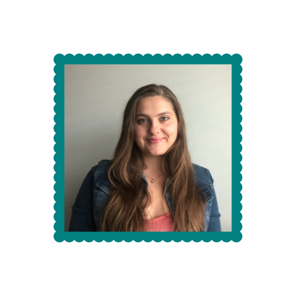

# **Hi, I'm Keragan!**

Human potential knows no bounds. Mounds of research support that humans are resilient, capable, and malleable. Psychology, health & well-being, and self-actualization have always captivated me. 

I am motivated by data-driven insights. My passion is to bridge the gap between data and health & wellness. I want to push forward individual, organizational, and community health & well-being through the power of data storytelling, visualization, and actionable insights. 

A need for continuous growth is central to my success and sanity. I have grown my skills in research, data analytics, leadership, collaboration, social media management, writing, and speaking. In my spare time, you can find me taking an online course to enhance my technical skills, listening to data analytics and psychology podcasts, or reading.

## This Website

In each tab, you will see different data analytics projects that I have done. Some professional, some just for fun! Feel free to explore and reach out to me if you want to connect!

## Let's Connect

2. Blog/journal what you are doing in R, by editing the Journal.Rmd. See the [Journal page](https://crumplab.github.io/LabJournalWebsite/Journal.html) for an example of what to do to get started learning R.

3. See the [links page](https://crumplab.github.io/LabJournalWebsite/Links.html) for lots of helpful links on learning R.

4. Change everything to make it your own.

</a>

